# Readme 

---

[Wordle](https://www.nytimes.com/games/wordle/index.html) like site where users can guess League of Legends champions endlessly. Inspiration taken greatly from another worlde clone [loldle.net](https://loldle.net).

Frontend is made with React and Bootstrap 5. Backend is made with Node.js and Express.js framework. Database is MySQL. Nginx is used as a webserver to serve frontend files and also to act as a reverse proxy for the backend.

Everything is packaged into Docker containers and those are managed with docker-compose.yml file in the backend directory. Created basic CI/CD pipeline with GitHub actions that builds frontend and deploys them to VPS.

Python was used gather champion data via web scraping and doing API requests.

Jest was used to make couple tests to backend.
## Demo
Demo of this repository will be available at [https://www.infiniteloldle.com](https://www.infiniteloldle.com).

---
## How to run backend
- `cd ./backend`
- run `npm i`
- install sql scheme with `*.sql` file
- create ".env" file and populate it with your credentials
  - `DB_HOST=localhost`
  - `DB_USERNAME=root`
  - `DB_PASSWORD=root`
  - `DB_DATABASE=loldle`
  - `TOKEN=some_secret_token_for_jwt_auth` # used only for importing data to database
  - `NODE_ENV=dev` # used only for importing data to database
  - `ENV=dev` # used only for importing data to database
- run `npm start` and the backend is running at [http://localhost:8081](http://localhost:8081)
---
## How to run frontend
- `cd ./frontend`
- run `npm i`
- run `npm start` and the frontend is running at [http://localhost:3000](http://localhost:3000)

---

## How to run tests
- `cd ./backend`
- run `npm test`

## Code coverage

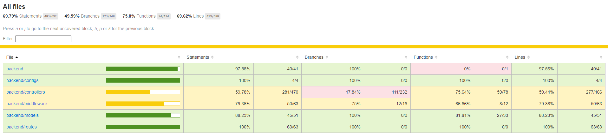

---
## Screenshots below from the site

First visit insert nickname
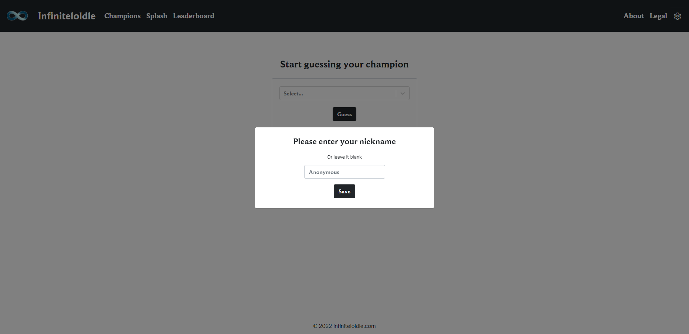

Guess champion game
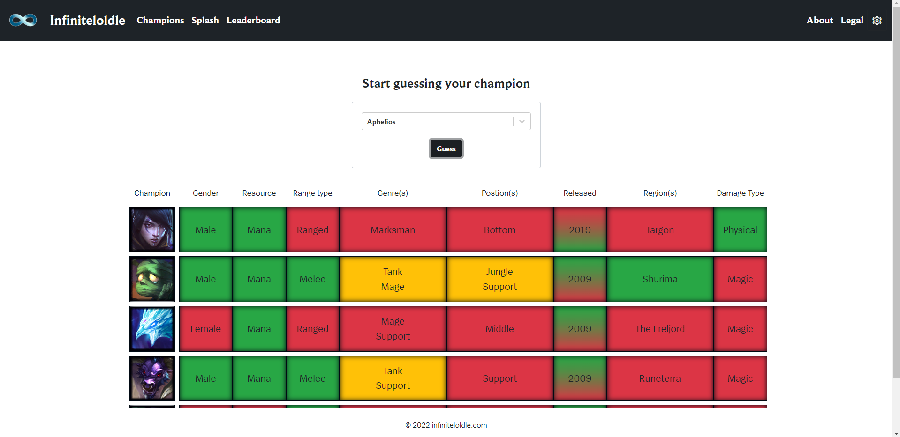

Guessed correclty
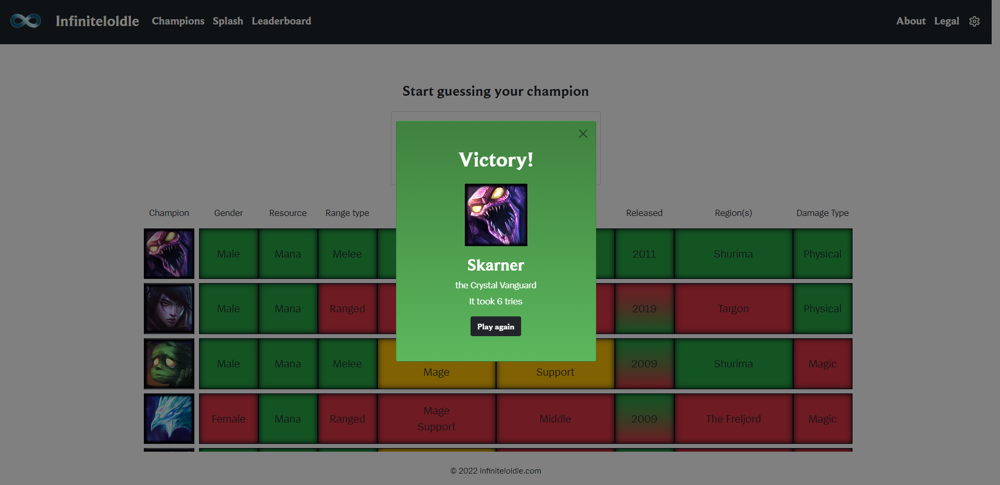

Guess champion based on splash art
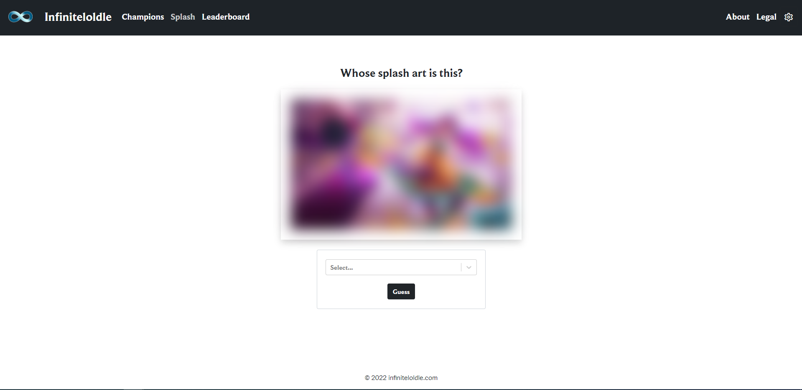

Image gets clearer when user guesses wrong
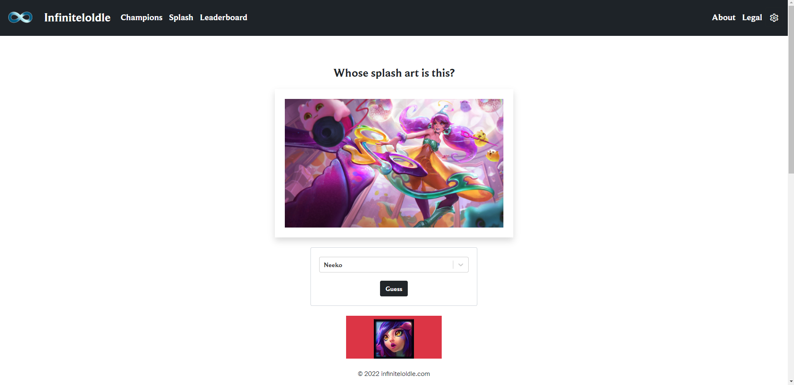

Correct champion guess on splash art game
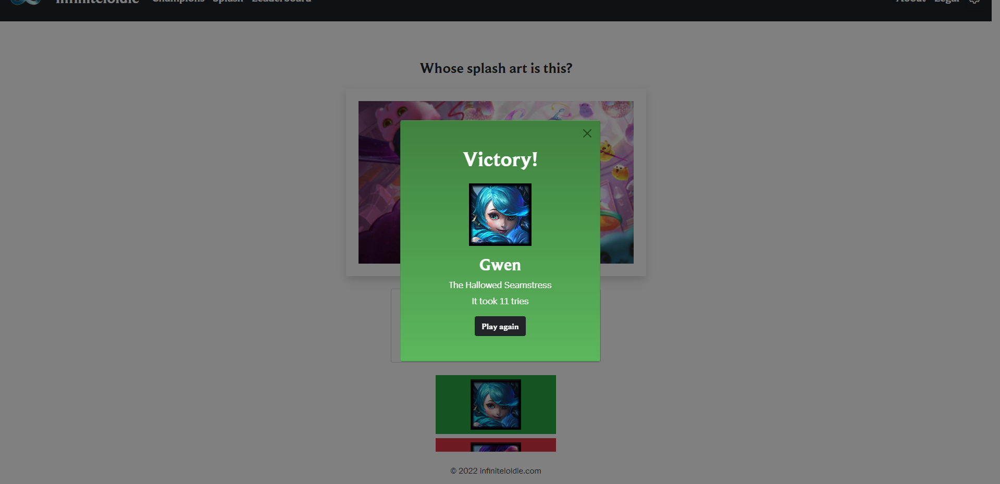

Item guessing game
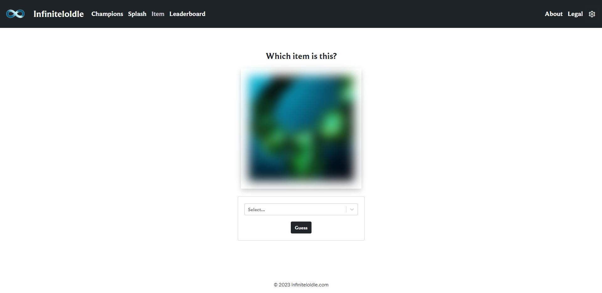

Items guessing game correct answer
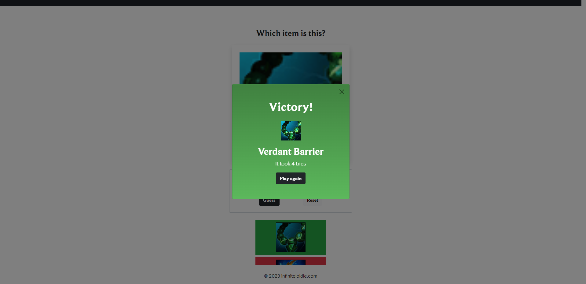

Leaderboard page
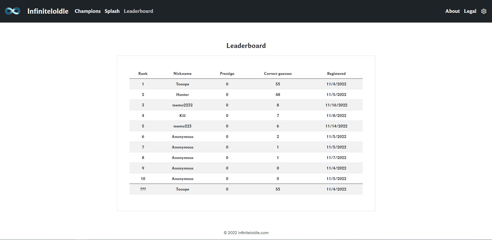

About page
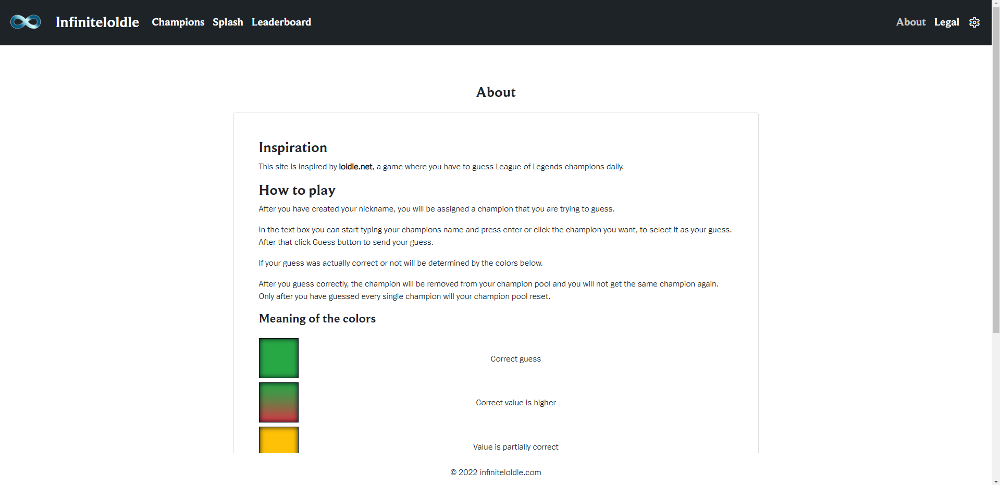

Rest of the about page

Legal page
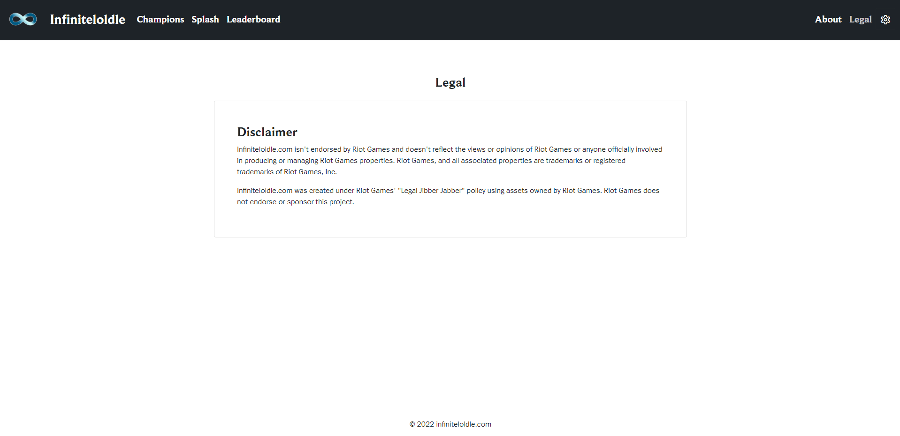

Settings menu
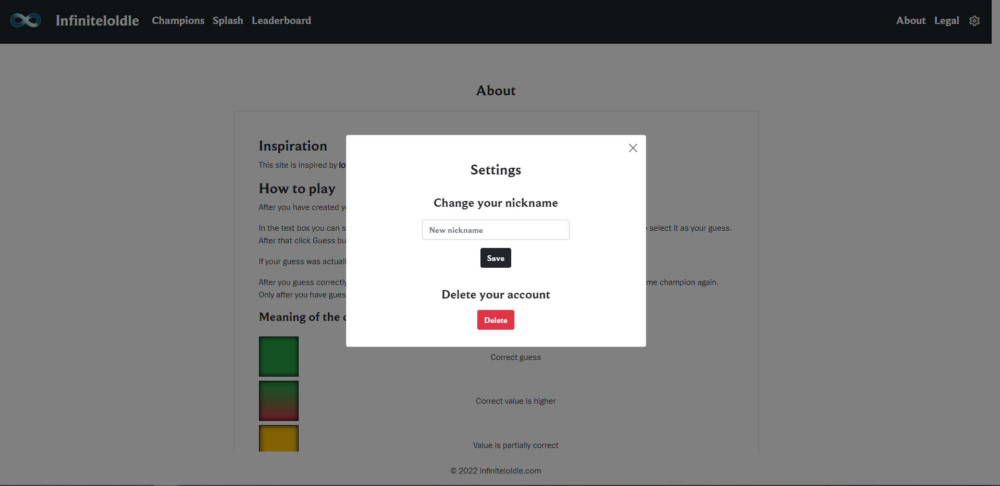

# Legal disclaimer

Infiniteloldle.com isn't endorsed by Riot Games and doesn't reflect the views or opinions of Riot Games or anyone officially involved in producing or managing Riot Games properties. Riot Games, and all associated properties are trademarks or registered trademarks of Riot Games, Inc.

Infiniteloldle.com was created under Riot Games' "Legal Jibber Jabber" policy using assets owned by Riot Games. Riot Games does not endorse or sponsor this project.
